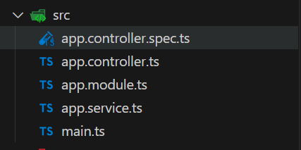

在本组文章中，您将了解 Nest 的**核心基础知识**。为了熟悉 Nest 应用程序的基本构建块，我们将构建一个基本的 CRUD 应用程序，其功能在入门级别涵盖了很多领域。

### 语言

我们爱上了 TypeScript，但最重要的是，我们喜欢 Node.js。这就是为什么 Nest 与 TypeScript 和纯 JavaScript 兼容的原因。Nest 利用了最新的语言特性，因此要将其与普通的 JavaScript 一起使用，我们需要一个 Babel 编译器。

在我们提供的示例中，我们主要使用 TypeScript，但您始终可以将代码片段切换为普通的 JavaScript 语法（只需单击即可切换每个代码片段右上角的语言按钮）。

### 环境

请确保您的操作系统上安装了 Node.js（版本 >= 16）。

### 项目创建

```bash
$ npm i -g @nestjs/cli
$ nest new project-name
```

如下所示：



<table>
    <tr>
        <td>app.controller.ts</td><td>具有单个路由的基本控制器。</td>
    </tr>  
    <tr>
        <td>app.controller.spec.ts</td><td>控制器的单元测试。</td>
    </tr>  
    <tr>
        <td>app.module.ts</td><td>应用程序的根模块。</td>
    </tr>  
    <tr>
        <td>app.service.ts</td><td>具有单一方法的基本服务。</td>
    </tr>  
    <tr>
        <td>main.ts</td><td>应用程序的入口文件，它使用 core 函数创建 Nest 应用程序实例。NestFactory</td>
    </tr>
</table>
