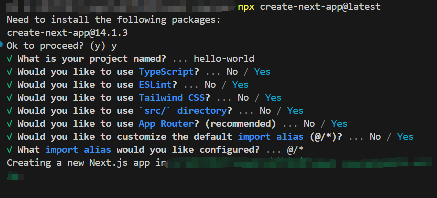
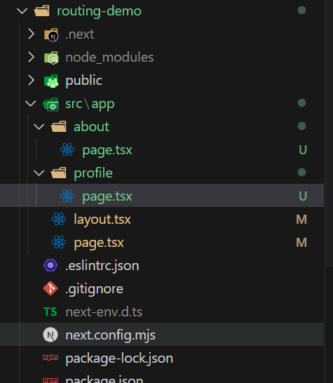
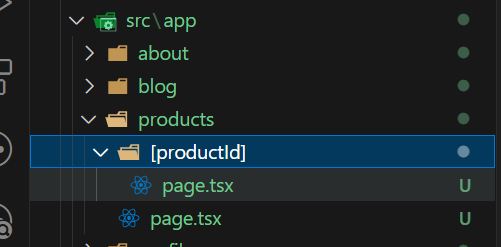
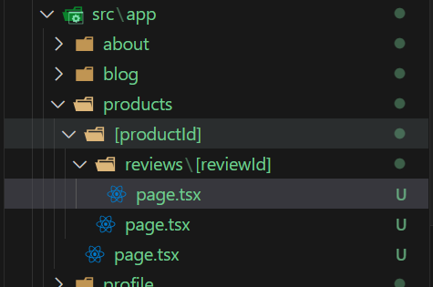
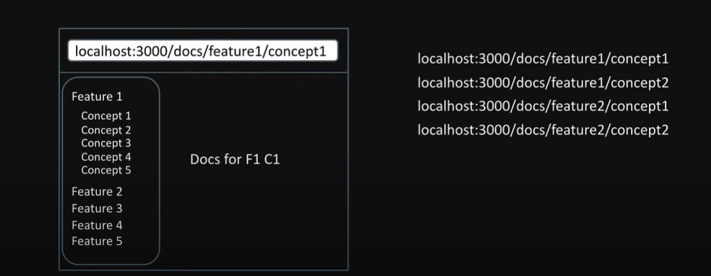

# 简介

在 YouTuKe 上发现的一个 NextJS14 的教学视频，下面是我做的一些笔记。可以看笔记，也可以直接去看视频。
[NextJS14](https://www.youtube.com/watch?v=ZjAqacIC_3c&list=PLC3y8-rFHvwjOKd6gdf4QtV1uYNiQnruI)

## Hello World

### Node 版本

Node.js 18.17 或更高版本。

### 安装

```bash
npx create-next-app@latest
```

#### 配置项



#### 文件目录


#### package.json

```json
{
  "name": "hello-world",
  "version": "0.1.0",
  "private": true,
  "scripts": {
    "dev": "next dev",
    "build": "next build",
    "start": "next start",
    "lint": "next lint"
  },
  "dependencies": {
    "react": "^18",
    "react-dom": "^18",
    "next": "14.1.3"
  },
  "devDependencies": {
    "typescript": "^5",
    "@types/node": "^20",
    "@types/react": "^18",
    "@types/react-dom": "^18",
    "autoprefixer": "^10.0.1",
    "postcss": "^8",
    "tailwindcss": "^3.3.0",
    "eslint": "^8",
    "eslint-config-next": "14.1.3"
  }
}
```

#### React Server Components(RSC)

## 路由

Next 的路由是 **约定式** 的，基于文件系统。

1. 重复上面步骤创建 routing-demo
2. 删除 `src/app` 中的 `app` 文件中所有的内容。
3. 初始化路由

```tsx
// src/app/page.tsx
export default function Home() {
  return <h1>Welcome Home</h1>;
}
```

执行 `npm run dev` 运行，访问 http://localhost:3000，我们会看到下面的内容。


另外可以发现，Next 自动创建了 layout.tsx。

4. 页面路由

如果我们想创建 http://localhost:3000/about 或者是 http://localhost:3000/profile 这种的页面路由。我们可以在 `app` 中新建两个文件夹，
分别是 `about` 和 `profile`，然后再创建 `page.tsx`。

这时，我们的目录结构如下图所示：



此时我们就可以在浏览器的地址栏中，通过 `/about` 或者 `/profile` 来切换页面。

5. 嵌套路由

创建 `blog` 文件夹，创建 `page.tsx` 文件，另外在 `page.tsx` 的同级目录下分别创建 `first` 和 `second` 以及它们的 `page.tsx` 文件。
此时我们就可以在地址栏中，通过 `/blog/first` 和 `/blog/second` 来访问这两个页面的内容。

格式目录如下：


6. 动态路由

在实际的应用场景中，虽然嵌套路由可以解决 `/blog/first` 和 `/blog/second` 这类页面需求，但是如果我们是一个商品列表，点击商品跳转详情。这时候使用嵌套路由就不太合适了。

这时候我们需要使用另一个模式去解决(动态路由)。

在 Next 中，`[文件名]` 是一种动态传递参数的约定。

我们可以通过这种方式来向子页面传递动态的参数。

新建文件夹 `products`，然后在 `products` 中创建 `[productId]` 文件夹，分别在各自文件夹中创建 `page.tsx`。
如下所示：



`[productId]` 文件代码：

```tsx
export default function ProductDetails({
  params,
}: {
  params: { productId: string };
}) {
  return <h1>Details about {params.productId}</h1>;
}
```

此时，我们通过 http://localhost:3000/products/productId 传递不同的 productId 值来展示不同 productId 的界面了。

7. 嵌套动态路由

应用场景：每个商品的评论详情，此时我们的路由可能是这样的。 `http://localhost:3000/products/2/reviews/2`

根据上面这个路由，以及前面的内容，其实可以推导出需要做的内容。

如下所示：



`[reviewId]`代码：

```tsx
export default function ReviewDetail({
  params,
}: {
  params: {
    productId: string;
    reviewId: string;
  };
}) {
  return (
    <h1>
      Review {params.productId} for product {params.reviewId}
    </h1>
  );
}
```

8. 捕获所有路由

在博客项目中，你可能会遇到这样的场景，



路由的组成是不固定的，这时候我们可以使用另一种方式来解决这个问题。


**注意：** `page.tsx` 是在 `[[...slug]]` 下的。

下面是 `page.tsx` 的代码。

```tsx
export default function Docs({
  params,
}: {
  params: {
    slug: string[];
  };
}) {
  console.log(1);
  if (params.slug?.length === 2) {
    return (
      <>
        Viewing docs for feature {params.slug[0]} and concept {params.slug[1]}
      </>
    );
  } else if (params.slug?.length === 1) {
    return <>Viewing docs for feature {params.slug[0]}</>;
  }
  return <h1>Docs</h1>;
}
```

现在可以在地址栏中通过 docs 后不同的路由地址 查看打印的内容 `http://localhost:3000/docs/1/v`、`http://localhost:3000/docs/1`。

另外还有一点`[[...slug]]` 如果变成 `[...slug]` 那么上面代码中`return <h1>Docs</h1>;`是不会被渲染的，页面会出现 404。

9. 未找到页面 (not-found)

在主页面中，如果不想使用 Next 自带的 404 界面，我们可以在 `src` 目录下创建 `not-found.tsx` 文件。

如果在其他的路由下想创建 404 页面，我们需要在当前路由下的文件中创建 `not-found.tsx`，然后在 `page.tsx` 中使用。如下：

```tsx
import { notFound } from "next/navigation";

export default function ReviewDetail({
  params,
}: {
  params: {
    productId: string;
    reviewId: string;
  };
}) {
  if (parseInt(params.reviewId) > 1000) {
    notFound();
  }
  return (
    <h1>
      Review {params.productId} for product {params.reviewId}
    </h1>
  );
}
```

如果当前文件目录中没有 `not-found.tsx` 那么它就会往上级寻找。如果都没有的话，就会显示默认的 404 界面。

404 页面，Next 为我们提供了默认的 404 界面。
