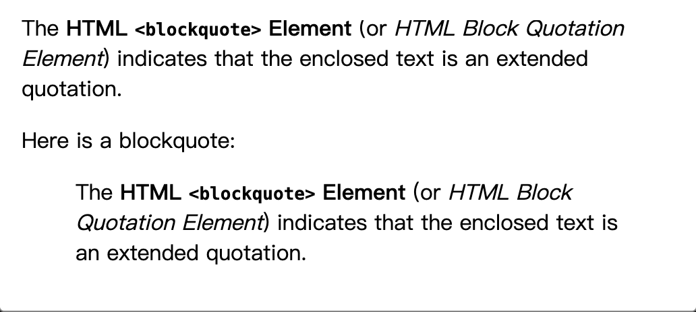
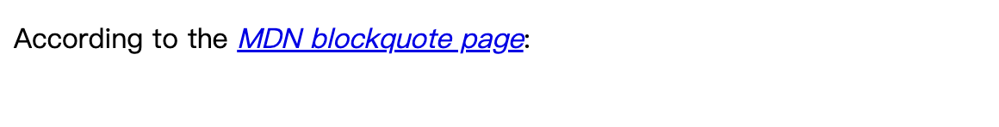
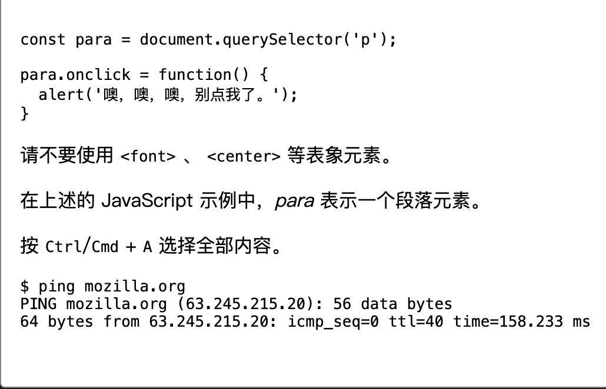

# 什么是 HTML

## 是什么

HTML 指的是超文本标记语言 (Hyper Text Markup Language)超文本标记语言。是一种用来告知浏览器如何组织页面的标记语言。

注：HTML 标签不区分大小写。

## 一个 HTML 元素


元素的主要组成部分有：

- 开始标签
- 内容
- 结束标签

整个元素就是指开始标签、内容、结束标签三部分组成的整体。

### 元素嵌套

```html
<p>My cat is <strong>very</strong> grumpy.</p>
```

### 块级元素和内联元素

- 块级元素在页面中以块的形式展示。如`<p>`、`<h1>`、`<div>`等

- 内联元素通常出现在块级元素中并环绕文档内容的一小部分，而不是一整个段落或者一组内容。如`<a>`、`<span>`、`<em>`(斜体)等

### 空元素

形如``没有闭合标签的标签。

### 属性


属性组成：

- 属性名
- 等号
- 属性值（由一对引号引起来）

### 布尔属性

```html
<input type="text" disabled="disabled" />

<input type="text" disabled />
<!-- 两者没有区别 -->
```

## HTML 文档

### HTML 组成部分

基本 html 结构：

```html
<!DOCTYPE html>
<html lang="zh-CN">
  <head>
    <meta charset="utf-8" />
    <title>我的测试站点</title>
  </head>
  <body>
    <p>这是我的页面</p>
  </body>
</html>
```

- `<!doctype html>`声明文档类型
- `<html>`元素是根元素
- `<head>`元素包含了文档的元（meta）数据，如`<meta charset="utf-8" />`定义网页编码格式为 utf-8
- `<title>`元素描述了网页标题
- `<body>`元素包含了可见的页面内容

### HTML 中的空白

HTML 会忽略多余的空格和换行，所以你可以随意缩进你的代码，以使代码更易读。元素内的空格会减少为一个单独的空格符。

### 转义字符

HTML 中的预留字符必须被替换为字符实体。如`<`替换为`&lt;`，`>`替换为`&gt;`
[XML 和 HTML 字符实体引用列表](https://zh.wikipedia.org/wiki/XML%E4%B8%8EHTML%E5%AD%97%E7%AC%A6%E5%AE%9E%E4%BD%93%E5%BC%95%E7%94%A8%E5%88%97%E8%A1%A8)

### 注释

```html
<p>我在注释外！</p>

<!-- <p>我在注释内！</p> -->
```

## `<head/>` 包含哪些内容

```html
<!DOCTYPE html>
<html lang="zh-CN">
  <head>
    <meta charset="utf-8" />
    <title>我的测试页面</title>
  </head>
  <body>
    <p>这是我的页面</p>
  </body>
</html>
```

基本：

- `<meta charset="utf-8" />`定义网页编码格式为 utf-8
- `<title>`元素描述了网页标题
- `<link>`元素定义了文档与外部资源的关系，最常用于连接样式表
- `<style>`元素包含了文档的内部样式表
- `<script>`元素用于加载脚本文件
- `<base>`元素为页面上的所有链接规定默认地址或默认目标

### meta 元素

meta 元素有两个属性：name 和 content

- name 指定了 meta 元素的类型；说明该元素包含了什么类型的信息
- content 指定了实际的元数据内容

```html
<meta name="author" content="Chris Mills" />
<meta
  name="description"
  content="The MDN Web Docs Learning Area aims to provide
complete beginners to the Web with all they need to know to get
started with developing web sites and applications."
/>
```

重点注意 description，搜索引擎会根据这个字段的内容来显示搜索结果（SEO）。

### link 元素为站点增加自定义图标

在浏览器的收藏夹及书签列表中显示。

方式：

- 将其保存在与网站的索引页面相同的目录中，以`.ico`格式保存（大多数浏览器支持更通用的格式，如`.gif`和`.png`）。

- 将一下代码添加到 HTML 的`<head>`块中以引用它。

```html
<link rel="icon" href="favicon.ico" type="image/x-icon" />
```

1. 在不同场景下使用不同的图标：

```html
<link rel="icon" href="/favicon-48x48.[some hex hash].png" />
<link rel="apple-touch-icon" href="/apple-touch-icon.[some hex hash].png" />
```

2. 为不同苹果设备提供不同的图标

```html
<!-- 含有高分辨率 Retina 显示屏的 iPad Pro：-->
<link
  rel="apple-touch-icon"
  sizes="167x167"
  href="/apple-touch-icon-167x167.png"
/>
<!-- 三倍分辨率的 iPhone：-->
<link
  rel="apple-touch-icon"
  sizes="180x180"
  href="/apple-touch-icon-180x180.png"
/>
<!-- 没有 Retina 的 iPad、iPad mini 等：-->
<link
  rel="apple-touch-icon"
  sizes="152x152"
  href="/apple-touch-icon-152x152.png"
/>
<!-- 二倍分辨率的 iPhone 和其他设备：-->
<link rel="apple-touch-icon" href="/apple-touch-icon-120x120.png" />
<!-- 基本图标 -->
<link rel="icon" href="/favicon.ico" />
```

注意：苹果设备会自动调整图标大小，所以不需要为不同设备提供不同大小的图标。

备注： 如果你的网站使用了内容安全策略（CSP）来增加安全性，这个策略会应用在 favicon 图标上。如果你遇到图标没有被加载的情况，可以确认 Content-Security-Policy 响应头的 img-src 指令有没有阻止访问图标。

## 文本处理基础

### 标题 和 段落

```html
<h1>这是标题 1</h1>
<h2>这是标题 2</h2>
<h3>这是标题 3</h3>
<h4>这是标题 4</h4>
<h5>这是标题 5</h5>
<h6>这是标题 6</h6>

<p>这是一个段落。</p>
<p>这是另一个段落。</p>
```

h1-h6 表示标题标签，表示的是六个层次。在实际开发中尽量遵守语义化的原则。一个页面最好只使用一次，剩余标题标签按照层级使用。

### 为什么我们需要结构化？

- 用户阅读网页时，往往会快速浏览以查找内容。
- 搜索引擎会分析网页结构以确定网页的主题。
- 网页结构有助于屏幕阅读器为视障用户读出网页内容。

### 为什么我们需要语义？

虽然我们可以通过 css 将一个元素变得跟某些元素自带的效果一样，但是语义化的标签可以更直观的表示出网页的结构，方便开发者阅读，也方便搜索引擎和屏幕阅读器理解网页内容。

### 列表

- 无序列表 `<ul>`
- 有序列表 `<ol>`
- 定义列表 `<dl>`

````html
<ul>
  <li>列表项 1</li>
  <li>列表项 2</li>
  <li>列表项 3</li>
</ul>

<ol>
  <li>列表项 1</li>

  <li>列表项 2</li>

  <li>列表项 3</li>
</ol>

<dl>
  <dt>项目 1</dt>
  <dd>描述项目 1</dd>
  <dt>项目 2</dt>
  <dd>描述项目 2</dd>
</dl>

### 重点强调 ```html
<em>斜体</em>
<strong>重点</strong>

<i>斜体</i>
<b>加粗</b>
<u>下划线</u>
````

## 超链接

```html
<a href="http://www.baidu.com">百度</a>
```

### 锚点

```html
<h2 id="Mailing_address">邮寄地址</h2>
<a href="#Mailing_address">我们的地址</a>
```

### 绝对 URL 和相对 URL

绝对 URL(包括协议和域名)：http://www.baidu.com
相对 URL：/index.html

### download 属性

download 属性可以强制浏览器下载链接指向的资源，而不是导航到该资源。

```html
<a
  href="https://download.mozilla.org/?product=firefox-latest-ssl&os=win64&lang=zh-CN"
  download="firefox-latest-64bit-installer.exe"
>
  下载最新的 Firefox 中文版 - Windows（64 位）
</a>
```

### 电子邮件链接

```html
<a href="mailto:nowhere@mozilla.org">向 nowhere 发邮件</a>
```

实际上邮箱地址是可选的，如果你省略了它那么你的 href 属性仅仅只是简单的 mailto:，这会打开用户的默认邮件客户端。

#### 指定详细信息

除了电子邮件地址，你还可以提供其他信息。事实上，任何标准的邮件头字段可以被添加到你提供的 mailto URL 中。其中最常用的是主题（subject）、抄送（cc）和主体（body）（这不是一个真正的标头字段，但允许你为新邮件指定一个简短的内容消息）。每个字段及其值被指定为查询项。

```html
<a
  href="mailto:nowhere@mozilla.org?cc=name2@rapidtables.com&bcc=name3@rapidtables.com&subject=The%20subject%20of%20the%20email&body=The%20body%20of%20the%20email"
>
  发送含有 cc、bcc、主题和主体的邮件
</a>
```

注意：备注：每个字段的值必须使用 URL 编码，即使用百分号转义的非打印字符（不可见字符如制表符、换行符、分页符）和空格。同时注意使用问号（?）来分隔主 URL 与参数值，以及使用 & 符来分隔 mailto: URL 中的各个参数。这是标准的 URL 查询标记方法。阅读 GET 方法以了解哪种 URL 查询标记方法是更常用的。

### target 属性

```html
<a href="https://developer.mozilla.org/" target="_blank">在新标签页中打开</a>
```

## 文档格式进阶

### 引用

#### 块引用

```html
<blockquote
  cite="https://developer.mozilla.org/zh-CN/docs/Web/HTML/Element/blockquote"
>
  <p>“使用 HTML 的力量。”</p>
</blockquote>
```



#### 行内引用

```html
<p>
  The quote element — <code>&lt;q&gt;</code> — is
  <q cite="https://developer.mozilla.org/zh-CN/docs/Web/HTML/Element/q"
    >intended for short quotations that don't require paragraph breaks.</q
  >
</p>
```


#### 引文

```html
<p>
  According to the
  <a href="/zh-CN/docs/Web/HTML/Element/blockquote">
    <cite>MDN blockquote page</cite></a
  >:
</p>
```



### 缩略语

```html
<p>
  我们使用
  <abbr title="超文本标记语言（Hyper text Markup Language）">HTML</abbr>
  来组织网页文档。
</p>

<p>
  第 33 届<abbr title="夏季奥林匹克运动会">奥运会</abbr>将于 2024 年 8
  月在法国巴黎举行。
</p>
```

### 标记联系方式

```html
<address>
  <p>
    Chris Mills<br />
    Manchester<br />
    The Grim North<br />
    UK
  </p>

  <ul>
    <li>Tel: 01234 567 890</li>
    <li>Email: me@grim-north.co.uk</li>
  </ul>
</address>
```

### 上标和下标

```html
<p>
  咖啡因的化学方程式是 C<sub>8</sub>H<sub>10</sub>N<sub>4</sub>O<sub>2</sub>。
</p>
<p>如果 x<sup>2</sup> 的值为 9，那么 x 的值必为 3 或 -3。</p>
```

### 展示计算机代码

- code 用于标记计算机通用代码。
- pre 用于保留空白字符（通常用于代码块）
- var 用于标记具体变量名
- kbd 用于标记输入电脑的键盘（或其他类型）输入
- samp 用于标记计算机程序的输出



### 标记时间和日期

```html
<time datetime="2016-01-20">2016 年 1 月 20 日</time>
```

## 文档与网站架构

### 文档的基本组成部分

一个网页一般是由 页眉、导航栏、主内容、侧边栏、页脚组成


为了方便残障人员，也是为了语义化为此HTML提供了明确这些区段的专用标签：

- header 页眉
- nav 导航栏
- main 主内容。主内容中还可以有各种子内容区段，可用 article、section、div等。
- aside 侧边栏
- footer 页脚

### HTML布局元素细节

详细细节可以查看
[HTML元素参考](https://developer.mozilla.org/zh-CN/docs/Web/HTML/Element)

- main 存放每个页面独有的内容。每个页面只能使用一次。不能把 `<main>` 放在 `<article>`、`<aside>`、`<footer>` 或者 `<header>` 元素内部。
- article 用于独立的、完整的、可以独立于网站其他内容进行分发或重复使用的结构（比如一篇博文）。
- section 用于对网站或应用程序中页面上的内容进行分块（比如文章的章节、标签页、日历中的月等）。
- aside 包含一些间接信息(术语条目、作者简介、相关链接)。
- header 页眉。通常包含网站logo、网站标题、导航菜单等。
- nav 包含页面主导航功能。其中不应包含二级链接等内容
- footer 页脚
- div 用于分组元素，没有实际语义。
- span 用于对文档中的内联元素进行组合，没有实际语义。

### 换行与水平分割线

`<br>`和`<hr>`

- br 换行
- hr 水平分割线