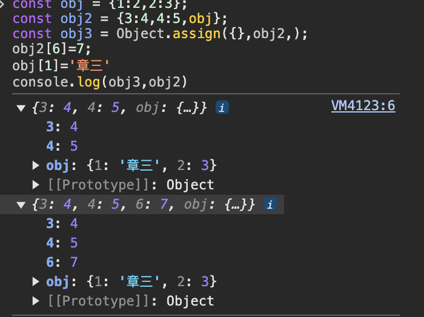
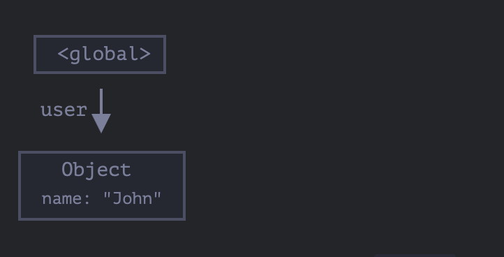
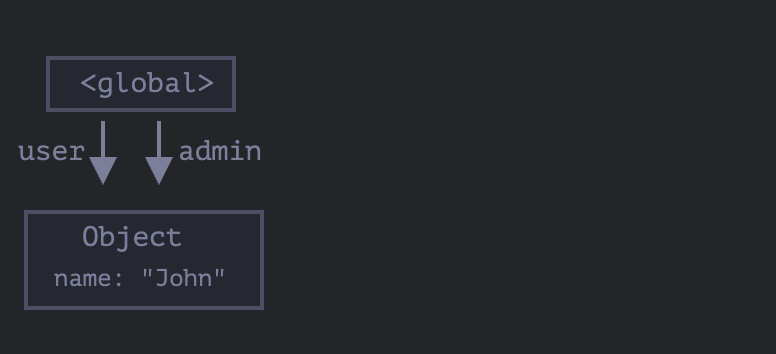
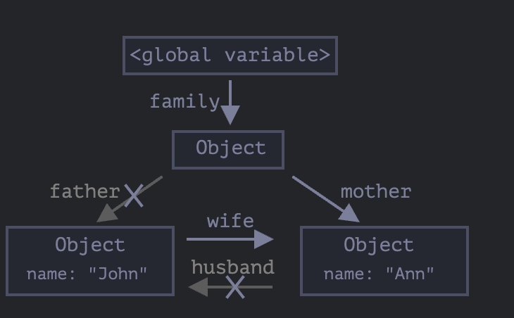
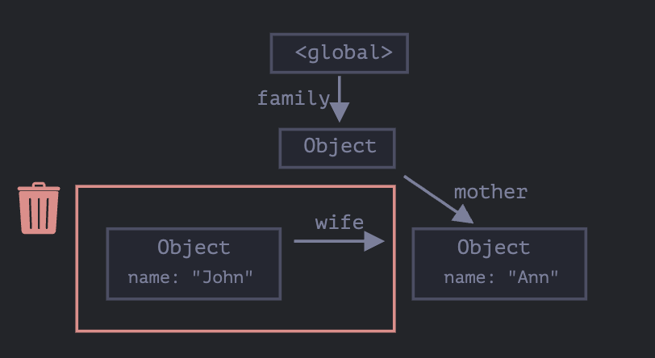
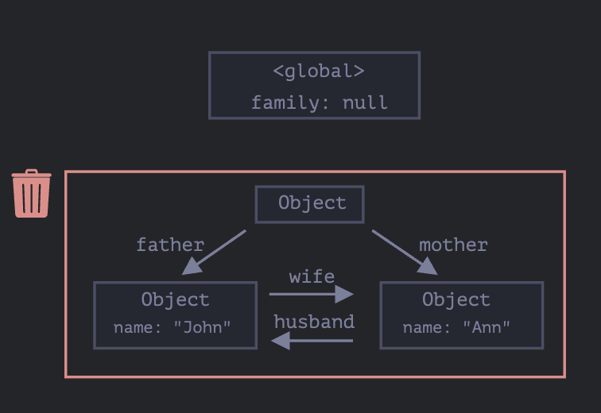

# 对象（基础）

## 对象是什么

独享是用来存储键值对和更复杂的实体。

创建方式：

- 字面量

```js
const obj = {};
```

#### 文本和属性

```js
const obj = {
  name: "张三",
  age: 18,
};

console.log(obj.name); //访问属性
console.log(obj["age"]); //访问属性
delete obj.age; //删除属性
```

#### 计算属性

```js
const key = "name";
const obj = {
  [key]: "张三李四",
};
```

这种方式称为**计算属性**，可以动态的设置属性名。

#### in 操作符

```js
const obj = {
  name: "章三",
};

console.log("name" in obj); //true
console.log("age" in obj); //false
```

为什么要有`in`操作符？

因为正常访问属性，如果属性不存在，会返回`undefined`，但是会有一种情况，属性存在，但是值为`undefined`，这时候就不好判断了。

#### for...in

```js
let user = {
  name: "张三",
  age: 30,
  isAdmin: true,
};

for (let key in user) {
  console.log(key, user[key]);
}
```

#### 对象排序

对象有顺序吗？

有，看 key 值，如果是能被解析为数字的字符串，会按照数字排序，否则按照字符串排序。

```js
const obj = {
  1: 5,
  4: 3,
  3: 6,
  "+2": 4,
};
console.log(obj); //{1: 5, 3: 6, 4: 3, +2: 4}
```

## 对象引用和复制

对象和原始类型的区别是，对象是'通过引用'存储和复制的。而原始类型：字符串、数字、布尔值等是通过值复制的。

因为对象是在堆中存储，栈中存储的是它的引用，而在复制的时候，复制的是引用，两个引用指向同一个对象。

## 对象的比较

对象只有在同一个引用时比较才相等。

```js
const obj = {};
const obj2 = obj;
console.log(obj === obj2); //true;
console.log(obj == obj2); //true;
```

```js
const obj = {};
const obj2 = {};

console.log(obj === obj2); //false;
```

## 克隆和合并

Object.assign

格式：

```js
Object.assign(target, ...sources);
```

- target：目标对象
- sources：源对象

**注意：** 如果源对象有相同的属性，后面的会覆盖前面的。

在复制的使用，如果源对象中存在引用类型的属性，那么复制的是引用，而不是值。



#### 深层克隆

深层克隆的意义就是完全将一个对象复制一份，并且复制的内容和原对象没有关系。

```js
//处理对象和数组的深拷贝
function deepClone(obj) {
  if (obj === null || typeof obj !== "object") {
    return obj;
  }

  let cloned = Array.isArray(obj) ? [] : {};

  if (Array.isArray(obj)) {
    obj.forEach((item, index) => {
      cloned[index] = deepClone(item);
    });
  } else {
    for (let key in obj) {
      if (obj.hasOwnProperty(key)) {
        cloned[key] = deepClone(obj[key]);
      }
    }
  }

  return cloned;
}
```

## 垃圾回收机制

对于 JavaScript 来说，内存管理是自动的。当对象不在被使用时，这个对象会在恰当的时机被回收清理掉。

#### 可达性（Reachability）

JavaScript 中主要的内存管理概念是 **可达性**。简单来说就是从根出发，任何不能被到达的对象都会被垃圾回收。

根：

- 当前执行的函数，它的局部变量和参数。
- 当前嵌套调用链上的其他函数、它们的局部变量和参数。
- 全局变量
- 还有一些其他的内部实现

这些值被称为根（roots）

如果一个值可以从根通过引用或者引用链进行访问，则认为该值是可达的。

在 JavaScript 引擎中有一个被称为[`垃圾回收器`](<https://en.wikipedia.org/wiki/Garbage_collection_(computer_science)>)的东西在后台执行。它监控着所有对象的状态，并删除掉那些不可达的内容。

例子：

```js
// user 具有对这个对象的引用
let user = {
  name: "John",
};
```



user 引用了对象，所以这个对象是可达的。

如果 user 的值被重写，这个引用就没了。在合适的时间垃圾回收器会
对垃圾数据进行回收，然后释放内存。

```js
user = null;
```


例子 2:

```js
let user = {
  name: "John",
};
let admin = user;
```



现在有两个变量共同访问这个对象，如果将其中一个引用删除。

```js
user = null;
```

这时候，这个对象仍然可达，因为 admin 引用了它。

例子 3:

```js
function marry(man, woman) {
  woman.husband = man;
  man.wife = woman;

  return {
    father: man,
    mother: woman,
  };
}

let family = marry({ name: "John" }, { name: "Ann" });
```

此时，father 和 mother 互相引用了，可以得到下面的这个图。


此事删除两个引用

```js
delete family.father;
delete family.mother.husband;
```



此时"John"就只有一个 wife 的运用，但是对于根来说，它已经不可达了。所以，“John”在合适的时机会被回收掉。



此时，经过回收之后，整条线就会变成一条单线。


此时如果将

```js
family = null;
```

那么整个对象都会被回收掉。



虽然 John 和 Ann 互相引用，但是对于根来说，它们已经不可达了。

#### 内部算法

垃圾回收的基本算法被称为"mark-and-sweep"

定期执行以下步骤：

- 垃圾收集器找到所有的根，并‘标记’它们。
- 然后便利并‘标记’来自它们的所有引用。
- 然后它遍历标记的对象并标记它们的引用。所有被遍历道德对象都会被记住，以免将来再次遍历到同一个对象。
- ...如此操作，知道所有可达的（从根部）引用都能被访问到。
- 没有被标记的对象都会被删除。

针对垃圾收集工作，JavaScript 引擎做了很多优化，使垃圾回收运行速度更快，并且不会对代码执行引入任何延迟。

优化：

- 分代收集：对象在标记时分为两组，新的和旧的。在代码中，很多对象的生命周期很短，将它们单独标记出来。针对旧对象，检查的频率会被降低。
- 增量收集：将整个对象集拆分，这样就会形成很多小的垃圾收集，然后将这些部分逐一清理。
- 闲时收集：垃圾收集器只会在 CPU 空闲时尝试运行，以减少可能对代码执行的影响。

推荐：

- [ V8 之旅：垃圾回收](http://jayconrod.com/posts/55/a-tour-of-v8-garbage-collection)
- [V8 博客](http://v8project.blogspot.com/)
- [Vyacheslav Egorov](http://mrale.ph/)

## 对象方法，this

#### 对象方法

对象的方法就是对象中的函数。

```js
let user = {
  name: "章三",
  age: 18,
  getAge() {
    console.log(this.age);
  },
};
user.getAge(); //18
```

**面向对象编程（OOP）**: 是一种编程思想，主要的概念是将数据和方法封装到对象中，不同的对象之间通过继承和组合来达到代码的复用。是一种编程范式。

方法简写：

```js
let user = {
  sayHi: function () {
    alert("Hello");
  },
};

// 方法简写看起来更好，对吧？
let user = {
  sayHi() {
    // 与 "sayHi: function(){...}" 一样
    alert("Hello");
  },
};
```

两种方式除了在表示法有些不同外，在对象继承方面也有一些细微的差别。不过在大多数情况下，更短的语法是首选。

#### 方法中的 this

this 是一个关键字，可以通过 this 直接访问当前对象的属性。在对象方法中，this 指向调用该方法的对象。

```js
let user = {
  name: "John",
  age: 30,

  sayHi() {
    // "this" 指的是“当前的对象”
    alert(this.name);
  },
};

user.sayHi(); // John
```

虽然我们可以直接通过 user.name 来访问，但是在当我们把对象赋值给另一个变量，那么它就访问到了一个错误的对象。

```js
let user = {
  name: "John",
  age: 30,

  sayHi() {
    alert(user.name); // 导致错误
  },
};

let admin = user;
user = null; // 重写让其更明显

admin.sayHi(); // TypeError: Cannot read property 'name' of null
```

#### this 不受限制

在 JavaScript 中，this 可以用于任何函数，即使不是它不是对象中的方法。

```js
function sayHi() {
  alert(this.name);
}
```

this 的值在代码中是运行时计算出来的，它取决于代码上下文。有个很简单的判定规则，谁调用了这个方法或函数，那么就由它的代码上下文来决定 this 归属。

**注：**在没有对象的情况下调用 `this == undefined`;在严格模式下 this 的值为 undefined，如果尝试访问 this.name 将会报错。在非严格模式下，this 将会是全局对象(浏览器中的 window)。这是个历史行为。

#### 箭头函数没有自己的 this

箭头函数没有自己的 this，它使用的是定义时所在上下文的 this。

```js
let user = {
  firstName: "Ilya",
  sayHi() {
    let arrow = () => alert(this.firstName);
    arrow();
  },
};

user.sayHi(); // Ilya
```

## 构造器和操作符 new

构造函数在技术上是常规函数。不过有两个约定：

1. 它们的命名以大写字母开头。
2. 它们只能由`new`操作符来执行。

```js
function User(name) {
  this.name = name;
  this.isAdmin = false;
}

let user = new User("Jack");
console.log(user.name); //Jack
console.log(user.isAdmin); //false
```

当一个函数被使用 `new` 操作符执行时，它按照以下步骤：

1. 一个新的空对象被创建并分配给`this`。
2. 函数体执行。通常它会修改`this`,为其添加新的属性。
3. 返回`this`的值。

换句话说，`new User(...)`做的事情如下：

```js
function User(name) {
  //this = {} (隐式创建)
  //添加属性到this
  this.name = name;
  this.isAdmin = false;

  //return this(隐式返回)
}
```

所以`new User('Jack')`的结果和以下操作的结果相同。

```js
let user = {
  name: "Jack",
  isAdmin: false,
};
```

构造器的目的就是实现可重用的对象创建代码。

从技术上来讲，任何函数（除了箭头函数，他没有自己的`this`）都可以用作构造器。即可以通过`new`来运行。“首字母大写”是一个共同的约定，用来表示一个函数将被用作构造器。

#### 构造器模式测试：new.target

在函数内部，可以使用 `new.target`属性来检查它是否被使用`new`进行调用了。常规调用下，它的值为`undefined`,对于`new`的调用，则等于该函数。

```js
function User(name) {
  console.log(new.target);
}

User(); //undefined;

// 带 new
new User(); //ƒ User(name){console.log(new.target);}
```

使用：

```js
function User(name) {
  if (!new.target) {
    // 如果你没有通过 new 运行我
    return new User(name); // ……我会给你添加 new
  }

  this.name = name;
}

let john = User("John"); // 将调用重定向到新用户
alert(john.name); // John
```

#### 构造器的 return

通常构造器不会出现 return 语句，但是如果有的话它会触发下面的规则：

- 如果 return 返回的是一个对象，则返回这个对象，而不是 this。
- 如果 return 返回的是一个原始类型，则忽略。

```js
function BigUser() {
  this.name = "John";

  return { name: "Godzilla" }; // <-- 返回这个对象
}

alert(new BigUser().name); // Godzilla，得到了那个对象
```

如果 return 为空或者 return 一个原始类型，对结果没有什么影响。

```js
function SmallUser() {
  this.name = "John";
  return; //返回this
}
console.log(new SmallUser().name); //John
```

#### 省略括号

如果构造器没有参数，可以省略括号。

```js
let user = new User(); //没有参数
let user = new User();
```

#### 构造器中的方法

```js
function User(name) {
  this.name = name;
  this.sayHi = function () {
    console.log("My name is" + this.name);
  };
}

let john = new User("John");
john.sayHi(); //My name is John;

john = {
  name: "John",
  sayHi: function () {
    console.log("My name is" + this.name);
  },
};
```

## 可选链 '?.'

```js
let user = {
  address: null,
};

console.log(user.address); //null
console.log(user.address.street); //Uncaught TypeError: Cannot read properties of null (reading 'street')
console.log(user.address?.street); //undefined
```

将不可访问的属性设置为`undefined`，而不是抛出错误。

#### 其他变体 `?.()` `?.[]`

```js
let userAdmin = {
  admin() {
    alert("I am admin");
  },
};

let userGuest = {};

userAdmin.admin?.(); // I am admin

userGuest.admin?.(); // 啥都没发生（没有这样的方法）
```

```js
let key = "firstName";

let user1 = {
  firstName: "John",
};

let user2 = null;

alert(user1?.[key]); // John
alert(user2?.[key]); // undefined
```

不止可以用来读取，我们还可以删除属性。

```js
delete user?.name;
```

#### 不可写入

```js
let user = null;
user?.name = 'John';//// Error，不起作用
// 因为它在计算的是：undefined = "John"
```

## Symbol

在 js 中只有两种原始类型可以作为对象属性键：

- 字符串类型
- symbol 类型

虽然你可以用数字类型去作为属性键，但是它会被转换为字符串。

```js
const user1 = { 1: 2, 1: 4 };
console.log(user1[1]); //4
console.log(user1["1"]); //4
```

#### symbol

‘symbol’值表示唯一的标识符。

创建 symbol：

```js
// let id = Symbol();

let id = Symbol("ids"); //ids 是这个symbol的描述。它只在调试时有用。
```

symbol 可以保证键的唯一性，即使两个 symbol 有相同的描述，它们也是不相等的。

```js
let id1 = Symbol("id");
let id2 = Symbol("id");
alert(id1 === id2); //false
```

#### symbol 不会被自动转换为字符串

```js
let id = Symbol("id");
alert(id); //Uncaught TypeError: Failed to execute 'alert' on 'Window': Cannot convert a Symbol value to a string
```

如果想要显示一个 symbol，需要用到`toString()`或者`description`属性。

```js
let id = Symbol("id");
alert(id.toString()); // Symbol(id)

alert(id.description); // id
```

#### “隐藏”属性

symbol 允许创建对象的隐藏属性，代码的任何其他部分都不能意外访问或重写这些属性。

```js
let user = {
  // 属于另一个代码
  name: "John",
};

let id = Symbol("id");

user[id] = 1;

alert(user[id]); // 我们可以使用 symbol 作为键来访问数据
```

这个主要的作用是当我们去为一些三方库添加属性或者方法的时候，不需要担心因为这些操作会影响原始库的方法或属性。

对象字面量中使用 symbol

```js
let id = Symbol("id");
let user = {
  name: "John",
  [id]: 123,
};
```

symbol 在 for...in 循环中会被跳过。

```js
let id = Symbol("id");
let user = {
  name: "John",
  age: 30,
  [id]: 123,
};

for (let key in user) alert(key); // name, age（没有 symbol）

// 使用 symbol 任务直接访问
alert("Direct: " + user[id]); // Direct: 123
```

Object.keys(user)也会忽略它们，这是一般‘隐藏符号属性’原则的一部分。
Object.assign 会同时复制字符串和 symbol 属性。

```js
let id = Symbol("id");
let user = {
  [id]: 123,
};

let clone = Object.assign({}, user);

alert(clone[id]); // 123
```

#### 全局 symbol

有时，我们希望同一个符号在多个脚本中是相同的。为此 symbol 提供了一个“全局 symbol 注册表”。它可以确保每次访问相同名字的 symbol 时，返回的都是相通的 symbol。

`Symbol.for(key)` 该方法会根据 key 去查找全局 symbol 注册表，如果存在则返回，如果不存在则创建一个新的 symbol，并添加到注册表中。

```js
//从全局注册表中读取
let id = Symbol.for("id"); //如果没有则会创建一个新的symbol

let idAgain = Symbol.for("id"); //

console.log(id === idAgain); // true
```

`Symbol.keyFor(sym)` 该方法会根据 symbol 去查找全局 symbol 注册表，如果存在则返回 key，如果不存在则返回 undefined。

```js
let id = Symbol.for("id");
alert(Symbol.keyFor(id)); // id

let globalSymbol = Symbol.for("name");
let localSymbol = Symbol("name");

console.log(Symbol.keyOf(globalSymbol)); // name
console.log(Symbol.keyOf(localSymbol)); // undefined
console.log(localSymbol.description); // name
```

#### 系统 symbol

| 规则名                      | 描述                      | 作用 |
| --------------------------- | ------------------------- | ---- |
| %Symbol.asyncIterator%      | Symbol.asyncIterator      |      |
| %Symbol.hasInstance%        | Symbol.hasInstance        |      |
| %Symbol.isConcatSpreadable% | Symbol.isConcatSpreadable |      |
| %Symbol.iterator%           | Symbol.iterator           |      |
| %Symbol.match%              | Symbol.match              |      |
| %Symbol.matchAll%           | Symbol.matchAll           |      |
| %Symbol.replace%            | Symbol.replace            |      |
| %Symbol.search%             | Symbol.search             |      |
| %Symbol.species%            | Symbol.species            |      |
| %Symbol.split%              | Symbol.split              |      |
| %Symbol.toPrimitive%        | Symbol.toPrimitive        |      |
| %Symbol.toStringTag%        | Symbol.toStringTag        |      |
| %Symbol.unscopables%        | Symbol.unscopables        |      |

具体解释：

- Symbol.asyncIterator

是 js 内置的一个值，用于定义对象的一步迭代器。异步迭代器是用于遍历异步数据集合的一种机制，通常用于处理一步操作或异步数据是用

一般来说，如果一个对象拥有 Symbol.asyncIterator 属性，那么它就是一个异步可迭代对象，可以通过 for-await-of 循环来迭代。

```js
const asyncData = {
  data: [1, 2, 3, 4],
  [Symbol.asyncIterator]: async function* () {
    for (let i = 0; i < this.data.length; i++) {
      await new Promise((resolve) =>
        setTimeout(() => {
          console.log("wait");
          resolve();
        }, 1000)
      );

      yield this.data[i];
    }
  },
};

(async function () {
  for await (let item of asyncData) {
    console.log(item);
  }
})();
```

- Symbol.hasInstance

用于判断对象是否是某个构造函数的实例。当使用 instanceof 操作时，会调用该方法。

```js
const MyArray = {
  [Symbol.hasInstance]: function (instance) {
    return Array.isArray(instance);
  },
};

const arr = [1, 2, 3];
console.log(arr instanceof MyArray); //true
```

- Symbol.isConcatSpreadable

用于判断对象是否应该用 Array.prototype.concat() 来展开。如果该属性值为 true，则表示对象应该被展开，否则不展开。

限制：

- 必须有 length 属性,切经过类型转换后为数字
- key 必须为数字

```js
const obj = {
  0: 1,
  1: 2,
  2: 3,
  // length:3,
  [Symbol.isConcatSpreadable]: true,
};

const arr = ["x", "y"];
const result = arr.concat(obj);
console.log(result);
```

- Symbol.iterator

用于定义对象的默认迭代器，当使用 for...of 循环时，会调用该方法。

```js
const obj = {
  data: ["apple", "banana", "orange"],
  [Symbol.iterator]: function () {
    let index = 0;
    return {
      next: () => {
        if (index < this.data.length) {
          return { value: this.data[index++], done: false };
        } else {
          return { value: undefined, done: true };
        }
      },
    };
  },
};

for (let item of obj) {
  console.log(item);
}
```

。。。。未完待续

----------------------------------------------------------------------

获取 Symbol 的方法，

- Object.getOwnPropertySymbols(obj) 获取对象自身的所有 Symbol 属性
- Reflect.ownKeys(obj); 获取对象自身的所有属性，包括 Symbol 属性

```js
const id = Symbol("id");
const obj = {
  a: 1,
  [id]: true,
};

const result = Object.getOwnPropertySymbols(obj);
console.log(result); //[Symbol(id)]

result.forEach((item) => {
  console.log(obj[item]);
});
```

```js
const id = Symbol("id");
const obj = {
  a: 1,
  [id]: true,
};

const result = Reflect.ownKeys(obj);
console.log(result);// ["a", Symbol(id)]

result.forEach((item) => {
  console.log(obj[item]);
});
```

## 对象-原始值转换

转换规则：

- 没有转换为布尔值。所有的对象在布尔上下文中均为`true`。只有字符串和数字转换。
- 数字转换发生在对象相减或应用数学函数时。例如，`Date`对象可以相减，结果时两个日期之间的差值。
- 字符串转换通常发生在想`alert(obj)`这样输出对象和类似的上下文中。

#### hint

类型转换在各种情况下有三种变体。被称为"hint"，在[规范](https://tc39.github.io/ecma262/#sec-toprimitive)中所述：

- string 

对象到字符串的转换，当我们对期望一个字符串的对象执行操作时，如‘alert’。
```js
// 输出
alert(obj);

// 将对象作为属性键
anotherObj[obj] = 123;

```

- number

对象到数字的转换，例如当我们进行数学运算时。
```js
// 显式转换
let num = Number(obj);

// 数学运算（除了二元加法）
let n = +obj; // 一元加法
let delta = date1 - date2;

// 小于/大于的比较
let greater = user1 > user2;
```

- default

在极少数情况下发生，党运算符‘不确定’期待值的类型时。
```js
// 二元加法使用默认 hint
let total = obj1 + obj2;

// obj == number 使用默认 hint
if(user==1){

}
```

像`<`和`>`这样的小于/大于比较运算符，也可以同时用于字符串和数字。不过，它们使用'number' hint,而不是‘default’。这是历史原因。

出了一种特殊情况（Date对象）之外，所有内建对象都以和"number"相同的方式实现"default"转换。

为了进行转换，JavaScript 尝试调用三个对象方法：

1. 调用`obj[Symbol.toPrimitive](hint)`----带有symbol键`Symbol.toPrimitive`（系统symbol）的方法，如果这个方法存在的话。
2. 否则，如果hint是“string”----尝试调用`obj.toString()`或`obj.valueOf()`,无论那个存在。
3. 否则，如果hint是“number”或“default”---尝试调用`obj.valueOf()`或`obj.toString()`,无论那个存在。

#### Symbol.toPrimitive

格式：

```js
obj[Symbol.toPrimitive] = function(hint) {
  // 这里是将此对象转换为原始值的代码
  // 它必须返回一个原始值
  // hint = "string"、"number" 或 "default" 中的一个
}

```

如果 `Symbol.toPrimitive`方法存在，则它会被用于所有`hint`,无需更多其他方法。

```js
let user = {
    name:"John",
    money:1000,
    [Symbol.toPrimitive](hint){
        console.log(`hint: ${hint}`);
        return hint === 'string'?`{name:"${this.name}"}`: this.money;
    }
}

alert(user);
alert(+user);
alert(user + 500);
```

#### toString/valueOf

如果没有`Symbol.toPrimitive`,那么JavaScript将尝试寻找`toString`和`valueOf`方法：

- 对于`string`hint:调用`toString`方法，如果它不存在，则调用`valueOf`方法（因此，对于字符串转换，优先调用`toString`）。

- 对于其他hint:调用`valueOf`方法，如果它不存在，则调用`toString`方法（因此对于数学运算，优先调用`valueOf`方法）。


`toString`和`valueOf`方法很早就有了。它们不是symbol，而是‘常规的‘字符串命名的方法。它们提供了一种可选的"老派"的实现转换的方法。

这些方法必须返回一个原始值。如果`toString`或`valueOf`返回了一个对象，那么返回值会被忽略。

默认情况下，普通对象具有`toString`和`valueOf`方法：

- `toString`方法返回一个字符串`"[object,Object]"`。
- `valueOf`方法返回对象自身。

```js
let user = {
    name:"John"
}

alert(user)//[object,Object]
alert(user.valueOf() === user);//true
```

使用`toString`和`valueOf`的实例

```js
let user = {
    name:'John',
    money:1000,

    // 对于 hint = 'string'
    toString(){
        return `{name: "${this.name}"}`;
    }

    // 对于 hint = 'number'
    valueOf(){
        return this.money;
    }
}

alert(user);// toString -> {name:"John"}
alert(+user);// valueOf -> 1000
alert(user + 500);// valueOf -> 1500
```

全能的`toString`

```js
let user = {
    name:'John',

    toString(){
        return this.name;
    }
}

alert(user);//John
alert(user + 500);//John500
```

如果没有`Symbol.toPrimitive`和`valueOf`,`toString`将处理所有原始转换。

#### 转换可以返回任何原始类型

关于所有原始转换方法，有一个重点的点需要知道，就是它们不一定会返回“hint”的原始值。

没有限制`toString()`是否返回字符串，或`Symbol.toPrimitive`方法是否为'number'hint返回数字。

唯一强制的事情是：这些方法必须返回一个原始值，而不是对象。

**历史原因：**由于历史原因，如果`toString`或`valueOf`返回一个对象，不会出现error，但是这种值会被忽略。但是`Symbol.toPrimitive`更严格，它必须返回一个原始值，否则会出现error。

#### 进一步的转换

许多运算符和函数执行类型转换，例如乘法`*`将操作数转换为数字。

如果将对象作为参数传递，则会出现两个运算阶段：

1. 对象会被转换为原始值（通过前面描述的规则）。
2. 如果还需要进一步计算，则声称的原始值会被进一步转换。

例如：

```js
let obj = {
    toString(){
        return '2'
    }
}

alert(obj * 2)//4
```

#### 总结：
对象到原始值的转换会有三种类型（hint）：

- string
- number 对于数学运算
- default 少数运算符，通常对象以和`number`相同的方式实现"default"转换。

转换算法是：

1. 调用`obj[Symbol.toPrimitive](hint)`,如果这个方法存在。
2. 否则，如果hint是’string‘
    - 尝试调用`obj.toString()`或`obj.valueOf()`,无论那个存在
3. 否则，如果hint是`"number"`或者`"default"`
    - 尝试调用`obj.valueOf()`或`obj.toString()`,无论那个存在。

所有这些方法都必须返回一个原始值才能工作（如果已定义）。

在实际使用中，通常只实现`obj.toString()`作为字符串转换的‘全能’方法就足够了，该方法应该返回对象的‘人类可读表示’，用于日志记录或调试。
