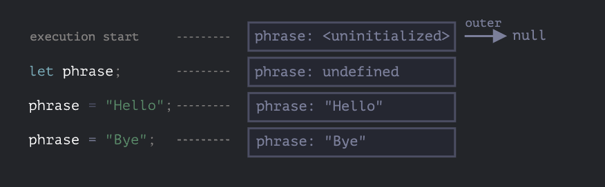
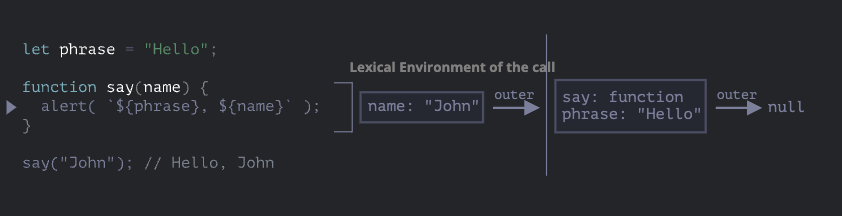
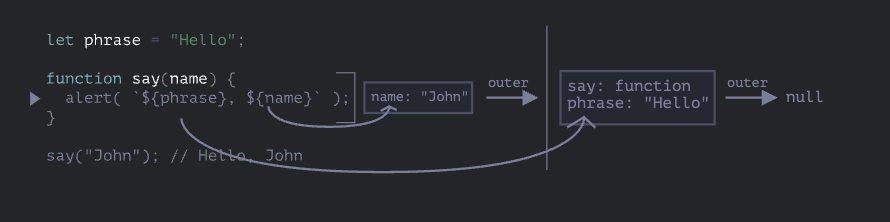
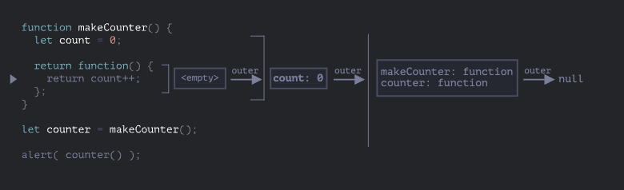
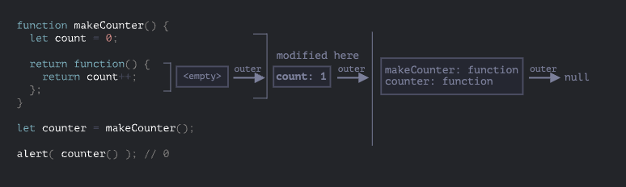

# 函数进阶

## 递归和堆栈

## Rest 参数和 Spread 语法

#### Rest 参数

将一些剩余参数放置到数组中。

**注意** Rest 参数必须放到参数列表的末尾。

```js
function foo(a, b, ...args) {
  console.log(a, b, args); //1,2, [3, 4, 5, 6]
}

foo(1, 2, 3, 4, 5, 6);
```

#### arguments 变量

函数有一个名为 arguments 的内置对象，该对象是一个类数组对象，包含函数调用时传递的所有参数。

箭头函数没有`arguments`

#### Spread 语法

将一个数组展开成单独的元素。实际上，Spread 语法可以将任何可迭代对象展开成单独的元素。

```js
let arr = [3, 5, 1];
alert(Math.max(arr));
```

## 变量作用域，闭包

#### 代码块

如果在代码块`{...}`内声明一个变量，那么这个变量只在该代码块中可见。

```js
{
  let message = "Hello";
  console.log(message); // Hello
}
console.log(message); //Uncaught ReferenceError: message is not defined
```

```js
{
  let message = "Hello";
  console.log(message); // Hello
}

{
  let message = "World";
  console.log(message); // World
}
```

对于 `if`、`for`、和`while`等，在`{...}`中声明的变量也仅在内部可见。

```js
if (true) {
  let phrase = "Hello!";

  alert(phrase); // Hello!
}

alert(phrase); // Error, no such variable!
```

```js
if (true) {
  let phrase = "Hello";
  console.log(phrase); //Hello
}
console.log(phrase); //Error
```

对于`for`和`while`循环也是如此：

```js
for (let i = 0; i < 3; i++) {
  console.log(i); //0 1 2
}

console.log(i); //Error
```

#### 嵌套函数

```js
function sayHibye(firstName, lastName) {
  function getFullName() {
    return firstName + " " + lastName;
  }

  console.log("Hello" + getFullName());
  console.log("Bye" + getFullName());
}
```

返回内部变量

```js
function makeCounter() {
  let count = 0;

  return function () {
    return count++;
  };
}

let counter = makeCounter();

console.log(counter()); //0;
console.log(counter()); //1;
console.log(counter()); //2;
```

#### 词法环境

##### Step1.变量

在 JavaScript 中，每个运行的函数，代码块`{...}`以及整个脚本，都有一个被称为**词法环境（lexical Environment）** 的内部（隐藏）的关联对象。

词法环境对象由两部分组成：

1. **环境记录(Environment Record)**:一个存储所有局部变量作为其属性（包括一些其他信息，例如`this`的值）的对象。

2. 对 **外部词法环境** 的引用，与外部代码相关联。

一个“变量“只是 **环境记录** 这个特殊的内部对象的一个属性。“获取或修改变量”意味着“获取或修改词法环境的一个属性”。

例如：这段没有函数的简单代码中只有一个词法环境：


这就是所谓的与整个脚本相关联的 **全局** 词法环境。

在上面的图片中，矩形表示环境记录（变量存储），箭头表示外部引用。全局词法环境没有外部引用，所以指向 null。

随着代码开始并继续运行，词法环境将发生变化。



右侧的矩形演示了执行过程中全局词法环境的变化：

1. 当脚本开始运行时，词法环境预先填充了所有声明的变量。
   - 最初，它们处于‘未初始化(Uninitialized)’状态。这是一个特殊的内部状态，这意味着引擎知道变量，但是在用`let`声明前，不能引用它。几乎就像变量不存在一样。
2. 然后`let phrase`定义出现，它未被赋值，因此它的值为`undefined`。从这一刻起，我们就可以使用变量了。
3. `phrase`被赋予了一个值。
4. `phrase`的值被修改。

总结下来就是两句话：

- 变量是特殊内部对象的属性，与当前正在执行的（代码）块/函数/脚本有关。
- 操作变量实际上是操作该对象的属性。

**注意词法环境是一个规范对象**：
‘词法环境’是一个规范对象（specification object）：它只存在于[语言规范](https://tc39.es/ecma262/#sec-lexical-environments)的‘理论’层面,用于描述事物是如何工作的。我们无法在代码中获取该对象并直接对其进行操作。

但是 js 引擎同样可以优化它，比如清除未被使用的变量以节省内存和执行内部其他技巧等，但显性行为应该和上述的无差。
:::

##### Step2.函数声明

一个函数其实也是一个值，就像变量一样。
**不同之处在于函数声明的初始化会被立即完成**

当创建了一个词法环境（Lexical Environment）时，函数声明会立即变为即用型函数（不像`let`那样知道声明处才可用）。

这就是为什么我们可以在声明自身之前调用一个以函数声明（Function Declaration）的方式声明的函数。

例如，这是添加一个函数时全局词法环境的初始状态：


正常来说，这种行为仅适用于函数声明，而不适用于将函数赋值给变量的函数表达式。

##### Step3 内部和外部的词法环境

在一个函数运行时，在调用刚开始时，会自动创建一个新的词法环境来存储这个调用的局部变量和参数。

例如对于`say('John')`，它看起来像这样（当前执行位置在箭头编辑的那一行上）：



在这个函数调用期间，我们有两个词法环境：内部一个（用于函数调用）和外部一个（全局）：

- 内部词法环境与`say`的当前执行相对应。它具有一个单独属性：`name`，函数的参数。我们调用的是`say('John')`,所以`name`的值为`"John"`。
- 外部词法环境是全局词法环境。它具有`phrase`变量和函数本身。

内部词法环境引用了`outer`。

当代码要访问一个变量时---首先会搜索内部词法环境，然后搜索外部环境，然后搜索更外部的环境，以此类推，直到全局词法环境。这就是所谓的“**作用域链**”。

如果在任何地方都找不到这个变量，那么在严格模式下会报错（在非严格模式下，为了向下兼容，给未定义的变量赋值会创建一个全局变量）。

在这个示例中，搜索过程如下：

- 对于`name`变量，当`say`中的`alert`试图访问`name`时，会立即在内部词法环境中找到它。
- 当它试图访问`phrase`时，内部没有`phrase`，所以它就顺着对外部词法环境的引用找到了它。



##### Step4.返回函数

以`makeCounter`为例

```js
function makeCounter() {
  let count = 0;
  return function () {
    return count++;
  };
}

let counter = makeCounter();
```

每次调用`makeCounter()`的开始，都会创建一个新的词法环境对象，以存储该 `makeCOunter` 运行时的变量。

因此，会有两层嵌套的词法环境：


不同的是，在执行`makeCounter()`的过程中创建了一个仅占用一行的嵌套函数：`return count++`。只是创建，没有执行。

**所有的函数在创建是都会记住创建它们的词法环境**。所有函数都有名为`[[Environment]]`的隐藏属性，该属性保存了对创建该函数的词法环境的引用。


因此, `counter.[[Environment]]`有对`{count:0}`词法环境的引用。这就是函数记住它创建于何处的方式，与函数在哪儿调用无关。`[[Environment]]`引用在函数被创建时被设置并永久保存。

稍后，当调用`counter()`时，会为该调用创建一个新的词法环境，并且其外部词法环境引用获取于`counter.[[Environmeng]]`。



现在，当`counter()`中的代码查找`count`变量时，它首先搜索自己的词法环境（为空，因为哪里没有局部变量），然后是外部`makeCounter()`的词法环境，并且在哪里找到就在哪里修改。

**在变量所在的词法环境中更新变量。**

这是执行后的状态：



如果调用`counter()`多次，`count`变量将会在同一位置增加到`2`,`3`等。

**注意：** [闭包](<https://en.wikipedia.org/wiki/Closure_(computer_programming)>)是指一个函数可以记住其外部变量并可以访问这些变量。在 JavaScript 中，所有函数都是天生闭包的（只有一个例外,将在[“new Function" 语法”](https://zh.javascript.info/new-function)中提到）。

也就是说：JavaScript 中的函数会自动通过隐藏的`[[Environment]]`属性记住创建它们的位置，所以它们都可以访问外部变量。

正确回答什么是闭包？：先回答闭包的定义，闭包（Closure）是指函数和其周围的词法环境（Lexical Environment）的组合。然后解释清楚为什么 JavaScript 中所有函数都是闭包的，以及可能的关于`[[Environment]]`属性和词法环境原理的技术细节。

#### 垃圾回收

通常在函数调用完成后，会将词法环境和其中的所有变量从内存中删除，因为现在没有任何对它们的引用了。与 JavaScript 中的任何其他对象一样，词法环境仅在可达时才会被保留在内存中。

但是，如果有一个嵌套的函数在函数结束后仍可达，则它将具有引用词法环境的`[[Environment]]`属性。

```js
function f() {
  let value = 123;
  return function () {
    alert(value);
  };
}

let g = f(); //g.[[Environment]]存储了对相应f()调用的词法环境的引用。
```

如果多次调用`f()`,并且返回的函数被保存，那么所有相应的词法环境对象也会保留在内存中。

```js
function f() {
  let value = Math.random();

  return function () {
    alert(value);
  };
}

// 数组中的 3 个函数，每个都与来自对应的 f() 的词法环境相关联
let arr = [f(), f(), f()];
```

当词法环境对象变得不可达时，它就会死去（就像其他任何对象一样）。换句话说，它仅在至少有一个嵌套函数引用它时才存在。

比如下面的代码，嵌套函数被删除后，其封闭的词法换几个（以及其中的`value`）也会被从内存中删除：

```js
function f() {
  let value = 123;

  return function () {
    alert(value);
  };
}

let g = f(); // 当 g 函数存在时，该值会被保留在内存中

g = null; // ……现在内存被清理了
```

## 老旧的"var"

::: info 本文用于帮助理解旧脚本

现在已经不会采用这种方式编写代码。

:::

变量的三种声明方式

- let
- const
- var

`var`声明与`let`相似。大部分情况下，我们可以用`let`代替`var`或者`var`代替`let`，都能达到预期的效果。

```js
var message = "Hi";
console.log(message); //Hi
```

#### var 没有块级作用域

用`var`声明的变量，不是函数作用域就是全局作用于。它们在代码块外也是可见的。

```js
if (true) {
  var test = "test";
}

console.log(test); //test

for (var i = 0; i < 10; i++) {
  var one = 1;
}

console.log(i); //10
console.log(one); //1

//只有在函数内部，才会出现作用于

function sayHi() {
  if (true) {
    var phrase = "Hello";
  }

  console.log(phrase); //Hello
}

sayHi();
console.log(phrase); //ReferenceError: phrase is not defined
```

#### var 允许重新声明

```js
var a;
var a;
```

#### var 声明的变量，可以在其声明语句前被使用

```js
function sayHi() {
  phrase = "Hello";

  console.log(phrase); //Hello

  var phrase;
}

sayHi();
```

从技术上讲，它和下面的情况是一样的

```js
function sayHi() {
  var phrase;

  phrase = "Hello";
  console.log(phrase); //Hello
}
sayHi();
// --------
function sayHi() {
  phrase = "Hello"; // (*)

  if (false) {
    var phrase;
  }

  alert(phrase);
}
sayHi();
```

这也是就是变量提升。不过只是声明提升，赋值并没有提升。

```js
function sayHi() {
  alert(phrase);

  var phrase = "Hello";
}

sayHi(); //undefined
```

`var phrase = 'Hello'`其实包含两个行为：

- `var phrase;`声明
- `phrase = 'Hello'`赋值

##### IIFE

立即执行函数表达式（Immediately Invoked Function Expression，简称 IIFE），是一种特殊的函数表达式。所谓立即执行函数，就是声明一个函数，并立即调用这个函数。

```js
(function () {
  // ...
  var message = "Hello";
  console.log(message);
})()(
  (function () {
    alert("Parentheses around the whole thing");
  })()
);

!(function () {
  alert("Bitwise NOT operator starts the expression");
})();

+(function () {
  alert("Unary plus starts the expression");
})();
```

## 全局对象

全局对象提供可在任何地方使用的变量和函数。默认情况下，这些全局变量内建于语言或环境中。

在浏览器中，它的名字是'window',对于 Nodejs 来说，它的名字是'global。其他环境可能用的是别的名字。

不过现在有一个统一的名字`globalThis`。它可以在任何环境中使用，并且总是指向全局对象。

全局对象的所有属性都可以被直接访问：

```js
alert("hello");

window.alert("hello");

var a = 1;
console.log(window.a);
```

需要注意的是`let、const`声明的变量是不可以的。

#### 使用 polyfills

我们可以使用全局对象来测试对现代语言功能的支持。

例如:

```js
if (!window.Promise) {
  alert("Your browser is really old!");
}
```

如果没有我们可以自己实现当前功能

```js
if (!window.Promise) {
  window.Promise = ... // our custom implementation
}
```

## 函数对象，NFE

在 JavaScript 中，函数的类型是对象。

可以把函数想象成可被调用的行为对象"action object"。我们不仅可以调用它们，还能把它们当作对象来处理：增/删属性，按引用传递等。

#### 属性“name”

```js
function sayHi() {
  console.log("Hi");
}

alert(sayHi.name); //sayHi
```

命名赋值有一个特性：**上下文命名**，如果函数自己没有提供，那么在赋值中，会根据上下文来推测一个。

对象方法也有名字

```js
let user = {
  sayHi: function () {
    //....
  },
  sayBye: function () {
    //....
  },
};

alert(user.sayHi.name); //sayHi
alert(user.sayBye.name); //sayBye
```

#### 属性 "length"

函数还有另一个内建属性“length”，它返回函数入参的个数

```js
function f1(a) {}

function f2(a, b) {}

function many(a, b, ...more) {}

console.log(f1.length); //1
console.log(f2.length); //2
console.log(many.length); //2
```

可以看到，rest 参数不参与计数。

属性 `length` 有时在操作其他函数的函数中用于做 [内省/运行时检查（introspection）](<https://zh.wikipedia.org/wiki/%E5%86%85%E7%9C%81_(%E8%AE%A1%E7%AE%97%E6%9C%BA%E7%A7%91%E5%AD%A6)>)。

关于[多态性](<https://en.wikipedia.org/wiki/Polymorphism_(computer_science)>)的应用。

```js
function ask(question, ...handlers) {
  let isYes = confirm(question);

  for (let handler of handlers) {
    if (handler.length == 0) {
      if (isYes) handler();
    } else {
      handler(isYes);
    }
  }
}

// 对于肯定的回答，两个 handler 都会被调用
// 对于否定的回答，只有第二个 handler 被调用
ask(
  "Question?",
  () => alert("You said yes"),
  (result) => alert(result)
);
```

#### 自定义属性

函数可以有自己的属性，就像对象一样。

```js
function sayHi() {
  alert("Hi");
  sayHi.counter++;
}

sayHi.counter = 0;

sayHi(); //Hi
sayHi(); //Hi

alert(sayHi.counter); //2
```

::: warning 属性不是变量

被赋值给函数的属性，比如`sayHi.counter = 0`,不回在函数内定义一个局部变量`counter`。可以把函数当作对象，在它里面存储属性。但是对它的执行没有影响。
:::

函数属性有时候可以替代闭包。

```js
function makeCounter() {
  // let count = 0;
  return function counter() {
    return counter.count++;
  };

  counter.count = 0;
  return counter;
}

let counter = makeCounter();
console.log(counter());
console.log(counter());
```

它和闭包的区别在于，闭包时引用了`makeCounter`内部的变量，外部无法直接访问。但是函数属性是可以直接被修改的。

#### 命名函数表达式（NFE）

命名函数表达式（Named Function Expression）是一种特殊的函数表达式。

```js
let sayHi = function (who) {
  console.log(`Hello ,${who}`);
};
```

然后给它加上一个名字

```js
let sayHi = function func(who) {
  console.log(`Hello ,${who}`);
};
```

意义：

- 它允许函数在内部引用自己
- 它在函数外是不可见的

```js
let sayHi = function func(who) {
  if (who) {
    alert(`Hello, ${who}`);
  } else {
    func("Guest"); // 使用 func 再次调用函数自身
  }
};

sayHi(); // Hello, Guest

// 但这不工作：
func(); // Error, func is not defined（在函数外不可见）
```

为什么不直接使用`sayHi`呢？因为如果在外部将`sayHi`重新赋值，那么函数内部的`func`将会失效。

```js
let sayHi = function func(who) {
  if (who) {
    console.log(`Hello,${who}`);
  } else {
    sayHi("Guest");
  }
};

let weclome = sayHi;
sayHi = null;

welcome(); //Error
```

::: info 函数声明没有这个东西

这里所说的‘内部名’特性只针对函数表达式，而不是函数声明。对于函数声明，没有用来添加‘内部’名的语法。

有时，我们需要一个可靠的内部名时，这就成为了你把函数声明重写成函数表达式的理由。

:::

## 'new Function'语法

#### 语法

```js
let func = new Function([arg1, arg2, ...argN], functionBody);
```

::: details 示例

```js
let sum = new Function("a", "b", "return a + b");

console.log(sum(1, 2)); //3
```

```js
let sayHi = new Function('alert("Hello")');

sayHi(); //Hello
```

:::

`new Function`允许将任意字符串变为函数。例如，可以在服务器接收一个新的函数并执行它。

```js

let str = ...// 从服务器获取的字符串

let func = new Function(str);
func();
```

#### 闭包

通常，闭包是指使用一个特殊的属性`[[Environment]]`来记录函数自身的创建时的环境的函数。它具体指向函数创建时的词法环境。

但是在使用`new Function`创建一个函数，那么该函数的`[[Environment]]`指向全局环境，而不是创建时的词法环境。

```js
function getFunc() {
  let value = "test";

  let func = new Function("alert(value)");
  return func;
}

getFunc()(); //Error
```

原因：主要在于当发不到生产环境时，需要使用压缩程序对其进行压缩，压缩程序会忽略掉`new Function`，这就造成了 你传的参数在外部已经被修改了。

#### 格式

```js
new Function("a", "b", "return a + b"); // 基础语法
new Function("a,b", "return a + b"); // 逗号分隔
new Function("a , b", "return a + b"); // 逗号和空格分隔
```

## 调度：setTimeout 和 setInterval

计划调用：

- `setTimeout` 将函数推迟一段时间间隔之后执行。
- `setInterval` 允许重复运行一个函数，从一段时间间隔之后开始运行，之后以该时间间隔连续重复运行该函数。

#### setTimeout

语法：

```js
let timerId = setTimeout(func|code,[delay],[arg1],[arg2],...)
```

- `func|code`：要执行的函数或代码字符串。
- `delay`：在执行代码前需等待的时间，以毫秒为单位。如果省略，则默认为 0。
- `arg1, arg2, ...`：要传递给函数的参数列表。

::: details 示例

示例 1

```js
function sayHi() {
  alert("Hello");
}

setTimeout(sayHi, 1000);
```

示例 2

```js
function sayHi(phrase, who) {
  alert(`${phrase},${who}`);
}

setTimeout(sayHi, 1000, "Hello", "John");
```

示例 3

```js
setTimeout("alert('Hello')", 1000);
```

:::

##### clearTimeout 来取消调度

```js
let timerId = setTimeout(...);
clearTimeout(timerId);
```

浏览器环境 HTML5 标准 [timer section](https://www.w3.org/TR/html5/webappapis.html#timers)

#### setInterval

`setInterval` 和 `setTimeout`的语法相同。

```js

let timerId = setInterval(func|code,[delay],[arg1],[arg2],...)
```

阻止后续调用，可以使用 `clearInterval(timerId)`。

#### 嵌套的 setTimeout

周期性调度有两种方式。

1. setInterval
2. setTimeout

::: code-tabs

@tab setInterval

```js
setInterval(() => alert("setInterval"), 1000);
```

@tab setTimeout

```js
/** instead of:
let timerId = setInterval(() => alert('tick'), 2000);
*/

let timerId = setTimeout(function tick() {
  alert("tick");
  timerId = setTimeout(tick, 2000); // (*)
}, 2000);
```

:::

示例：实现一个服务，没间隔 5 秒行服务器发送一个请求，但是如果服务器过载，就降低请求频率。
伪代码示例：

```js
let delay = 5000;

let timerId = setTimeout(function request() {
  ...发送请求...

  if (request failed due to server overload) {
    // 下一次执行的间隔是当前的 2 倍
    delay *= 2;
  }

  timerId = setTimeout(request, delay);

}, delay);
```

::: info 垃圾回收和 setInterval/setTimeout 回调（callback）

当一个函数传入`setInterval/setTimeout`时，将为其创建一个内部引用，并保存在调度程序中。这样，即使这个函数没有其他引用，也能防止垃圾回收器（GC）将其回收。

```js
// 在调度程序调用这个函数之前，这个函数将一直存在于内存中
setTimeout(function() {...}, 100);
```

对于`setInterval`，传入的函数也是一直存在于内存中，直到`clearInterval`被调用。

这里还要提到一个副作用。如果函数引用了外部变量（闭包），那么只要这个函数还存在，外部变量也会随之存在。它们可能比函数本身占用更多的内存。因此，当我们不再需要调度函数时，最好取消它，即使这是个（占用内存）很小的函数。
:::

#### 零延时的 setTimeout

特殊的用法：`setTimeout(func, 0)`或者`setTimeout(func)`。

这样调度可以让`func`尽快执行。但是只有在当前正在执行的脚本执行完成后，调度程序才会调用它。

```js
setTimeout(() => alert("World"));

alert("Hello");
```

::: info 零延迟实际上不为零（在浏览器中）
在浏览器环境中，嵌套定时器的运行频率是受限制的，如果定时器嵌套超过 5 层，那么时间间隔会被强制设定为至少 4 毫秒。[（HTML5 标准）](https://html.spec.whatwg.org/multipage/timers-and-user-prompts.html#timers)

```js
let start = Date.now();
let times = [];

setTimeout(function run() {
  times.push(Date.now() - start); // 保存前一个调用的延时

  if (start + 100 < Date.now()) alert(times); // 100 毫秒之后，显示延时信息
  else setTimeout(run); // 否则重新调度
});
```

:::

能让延时变慢的原因：

- CPU 过载
- 浏览器页签处于后台模式
- 笔记本电脑用的是省电模式。

当出现这些因素时，浏览器的最小延迟可能会增加到 300ms 甚至 1000ms。

## 装饰器模式和转发 call/apply

#### 透明缓存

```js
function slow(x) {
  console.log(`Called with ${x}`);
  return x;
}

function cachingDecorator(func) {
  let cache = new Map();

  return function (x) {
    if (cache.has(x)) {
      return cache.get(x);
    }

    let result = func(x);

    cache.set(x, result);
    return result;
  };
}

slow = cachingDecorator(slow);

console.log(slow(1)); // slow(1) 被调用
console.log("Again" + slow(1)); // 从缓存中读取

console.log(slow(2)); // slow(2) 被调用
console.log("Again" + slow(2)); // 从缓存中读取
```

`cacingDecorator` 是一个 **装饰器（decorator）：** 它是一个特殊的函数，接受另一个函数并改变它的行为。

#### 使用 func.call 设定上下文

```js
let worker = {
  someMethod() {
    return 1;
  },
  slow(x) {
    console.log(`Called with ${x}`);
    return x * this.someMethod(); // 'this' 是 worker
  },
};

function cachingDecorator(func) {
  let cache = new Map();

  return function (x) {
    if (cache.has(x)) {
      return cache.get(x);
    }

    let result = func(x);
    cache.set(x, result);
    return result;
  };
}

console.log(worker.slow(1)); // 1

worker.slow = cachingDecorator(worker.slow);
console.log(worker.slow(2)); //Uncaught TypeError: this.someMethod is not a function
```

发生错误的原因是在传递过程中，`this` 丢失了。

```js
func.call(context, ...args);
```

它运行`func`，提供的第一个参数为`this`，后面的座位参数的`arguments`。

```js
func(1, 2, 3);
func.call(obj, 1, 2, 3);
```

这两种写法是等价的。

```js
function sayHi() {
  console.log(this.name);
}

let user = { name: "John" };
let admin = { name: "Admin" };

sayHi.call(user); // John
sayHi.call(admin); // Admin
```

```js
let worker = {
  someMethod() {
    return 1;
  },
  slow(x) {
    console.log(`Called with ${x}`);
    return x * this.someMethod(); // 'this' 是 worker
  },
};

function cachingDecorator(func) {
  let cache = new Map();

  return function (x) {
    if (cache.has(x)) {
      return cache.get(x);
    }

    let result = func.call(this, x);
    cache.set(x, result);
    return result;
  };
}

console.log(worker.slow(1)); // 1

worker.slow = cachingDecorator(worker.slow);
console.log(worker.slow(2));
```

#### 传递多个参数

```js
let worker = {
  slow(min, max) {
    alert(`Called with ${min},${max}`);
    return min + max;
  },
};

function cachingDecorator(func, hash) {
  let cache = new Map();
  return function () {
    let key = hash(arguments); // (*)
    if (cache.has(key)) {
      return cache.get(key);
    }

    let result = func.call(this, ...arguments); // (**)

    cache.set(key, result);
    return result;
  };
}

function hash(args) {
  return args[0] + "," + args[1];
}

worker.slow = cachingDecorator(worker.slow, hash);

alert(worker.slow(3, 5)); // works
alert("Again " + worker.slow(3, 5)); // same (cached)
```

#### func.apply

语法：

```js
func.call(context, ...args);
func.apply(context, args);
```

和 func.call 的区别：

- call 期望一个参数列表，而 apply 期望一个包含这些参数的类数组对象。
- Spread 语法`...`允许将可迭代对象`args`座位列表传递给`call`。
- `apply`只接受类数组`args`。
- 对于可迭代又是累数组的对象，例如一个真正的数组，两者都可以使用，但是`apply`可能更快。因为大多数 JavaScript 引擎在内部对其进行了优化。

将所有参数连同上下文一起传递给另一个函数被称为呼叫转移(call forwarding)。

```js
let wrapper = function () {
  return func.apply(this, arguments);
};
```

#### 借用一种方法

```js
function hash(args) {
  return args[0] + "," + args[1];
}

function hash() {
  return [].join.call(arguments, ",");
}
```

#### 装饰器和函数属性

正常来说，用装饰器替换一个函数或方法是安全的，除了一个小东西。如果原始函数有属性,例如`func.calledCount`或其他，则装饰后的函数将不再提供这些属性。也有解决办法，比如使用`Proxy`对象来包装函数。

#### 任务

- 间谍装饰器

创建一个装饰器`spy(func)`，它返回一个包装器，该包装器将所有对函数的调用保存在其`calls`属性中。

每个调用都保存为一个参数数组。

```js
function work(a, b) {
  alert(a + b); // work 是一个任意的函数或方法
}

work = spy(work);

work(1, 2); // 3
work(4, 5); // 9

for (let args of work.calls) {
  alert("call:" + args.join()); // "call:1,2", "call:4,5"
}
```

实现：

```js
function spy(func) {
  function wrapper(...args) {
    wrapper.calls.push(args);

    return func.apply(this, args);
  }

  wrapper.calls = [];

  return wrapper;
}

function work(a, b) {
  alert(a + b); // work 是一个任意的函数或方法
}

work = spy(work);

work(1, 2); // 3
work(4, 5); // 9

for (let args of work.calls) {
  alert("call:" + args.join()); // "call:1,2", "call:4,5"
}
```

- 延时装饰器

创建一个装饰器`delay(f,ms)`，该装饰器将`f`的每次调用延时`ms`毫秒。

例如：

```js
function f(x) {
  console.log(x);
}

let f1000 = delay(f, 1000);
let f2000 = delay(f, 2000);

f1000("test"); // 在 1 秒后显示 "test"
f2000("test"); // 在 2 秒后显示 "test"
```

实现：

```js
function delay(f, ms) {
  return function (...args) {
    setTimeout(() => f.apply(this, args), ms);
  };
}
```

- 防抖装饰器

只处理最后一次

```js
function debounce(f, ms) {
  let timeout;

  return function (...args) {
    clearTimeout(timeout);
    timeout = setTimeout(() => f.apply(this, args), ms);
  };
}
```

- 节流装饰器

固定的时间间隔执行

```js
function throttle(func, ms) {
  let isThrottled = false,
    savedArgs,
    savedThis;

  function wrapper() {
    if (isThrottled) {
      // (2)
      savedArgs = arguments;
      savedThis = this;
      return;
    }
    isThrottled = true;

    func.apply(this, arguments); // (1)

    setTimeout(function () {
      isThrottled = false; // (3)
      if (savedArgs) {
        wrapper.apply(savedThis, savedArgs);
        savedArgs = savedThis = null;
      }
    }, ms);
  }

  return wrapper;
}
```

## 函数绑定

#### 丢失 this

```js
let user = {
  firstName: "John",
  sayHi() {
    console.log(`Hello, ${this.firstName}!`);
  },
};

setTimeout(user.sayHi, 1000); // Hello, undefined!
```

解决办法：

- 包装器

```js
let user = {
  firstName: "John",
  sayHi() {
    console.log(`Hello, ${this.firstName}!`);
  },
};

setTimeout(() => {
  user.sayHi();
}, 1000); // Hello, John!
```

这种方式有一个小问题，就是当 user 被重置时，会得到重置后的函数

```js
let user = {
  firstName: "John",
  sayHi() {
    console.log(`Hello, ${this.firstName}!`);
  },
};

setTimeout(() => {
  user.sayHi();
}, 1000); // hello

user = {
  sayHi() {
    console.log("hello");
  },
};
```

- bind

```js
let boundFunc = func.bind(context);
```

```js
let user = {
  firstName: "John",
};

function func() {
  alert(this.firstName);
}

let funcUser = func.bind(user);
funcUser(); // John
```

所有参数都会原样传递给初始的`func`，例如：

```js
let user = {
  firstName: "John",
};

function func(phrase) {
  console.log(phrase + ", " + this.firstName);
}

let funcUser = func.bind(user);

funcUser("Hello"); // Hello, John
```

对象方法：

```js
let user = {
  firstName: "John",
  sayHi() {
    console.log(`Hello, ${this.firstName}!`);
  },
};

let sayHi = user.sayHi.bind(user);

sayHi(); // Hello, John!

setTimeout(sayHi, 1000); // Hello, John!

user = {
  sayHi() {
    alert("Another user in setTimeout!");
  },
};
```

#### 参数

```js
let bound = func.bind(context,[args1],[args2],...);
```

它允许将上下文绑定为`this`，以及绑定函数的部分参数。

```js
function mul(a, b) {
  return a * b;
}

let double = mul.bind(null, 2);

console.log(double(3)); // === double(2,3) === 6
console.log(double(4)); // === double(2,4) === 8
```

上面这种方式被称为[函数的部分应用（partial function application）](https://en.wikipedia.org/wiki/Partial_application)

#### 使用 bind 实现函数柯理化

```js
function multiply(x, y, z) {
  return x * y * z;
}

// 使用 bind 实现柯里化
function curry(fn, ...args) {
  return args.length >= fn.length ? fn(...args) : curry.bind(null, fn, ...args);
}

const curriedMultiply = curry(multiply);

console.log(curriedMultiply(2)(3)(4)); // 输出 24
console.log(curriedMultiply(5, 2)(3)); // 输出 30
```

`fn.length`

- 对于普通函数，length 属性返回函数定义时声明的参数个数，不包括剩余参数。
- 对于具有默认参数的函数，length 属性不包括具有默认值的参数在内。
- 对于箭头函数，length 属性返回该函数的形参个数，不考虑剩余参数。
- 对于使用剩余参数的函数，length 属性不包括剩余参数。


#### 在没有上下文的情况下partial

```js
function partial(func, ...argsBound) {
  return function(...args) { // (*)
      console.log(this)
    return func.call(this, ...argsBound, ...args);
  }
}

// 用法：
let user = {
  firstName: "John",
  say(time, phrase) {
    alert(`[${time}] ${this.firstName}: ${phrase}!`);
  }
};

// 添加一个带有绑定时间的 partial 方法
user.sayNow = partial(user.say, new Date().getHours() + ':' + new Date().getMinutes());

user.sayNow("Hello");
```

`partial(func[,arg1,arg2...])`调用的结果是一个包装器`(*)`,它调用`func`并具有以下内容：

- 与它获得的函数具有相同的`this`（对于`user.sayNow`调用来说，它是`user`。
- 然后给它`...argsBound`---来自于`partial`调用的参数（`"10:00"`）。
- 然后给它`...args`---给包装器的参数（`"Hello"`）


## 深入理解箭头函数

#### 箭头函数没有“this”

箭头函数没有自己的`this`

```js
let group = {
  title: "Our Group",
  students: ["John", "Pete", "Alice"],

  showList() {
    this.students.forEach(
      student => alert(this.title + ': ' + student)
    );
  }
};

group.showList();

```

::: warning 不能对箭头函数进行`new` 操作

箭头函数没有自己的this，所以不能用作构造器。不能用`new`调用它们。

:::

::: tip 箭头函数 VS bind

箭头函数和使用.bind(this)的差异在于

- `.bind(this)`创建了一个该函数的绑定版本
- 箭头函数没有创建任何绑定，只是没有`this`。需要从外部词法环境中查找。
:::

#### 箭头函数没有“arguments”

箭头函数没有`arguments`变量。

比如下面这个例子，将调用延迟`ms`调用

```js
// apply版本
function defer(f,ms){
  return function(){
    setTimeout(()=>f.apply(this,arguments),ms)
  }
}

function sayHi(who){
  console.log('Hello'+who);
}

let sayHiDeferred = defer(sayHi, 2000);
sayHiDeferred("John"); // 2 秒后显示：Hello, John

// call版本
function defer(f,ms){
  return function(){
    setTimeout(()=>f.call(this,[...arguments]),ms)
  }
}

function sayHi(who){
  console.log('Hello'+who);
}

let sayHiDeferred = defer(sayHi, 2000);
sayHiDeferred("John"); // 2 秒后显示：Hello, John

// bind版本

function defer(f,ms){
  return function(...args){
    setTimeout(f.bind(this,...args),ms)
  }
}

function sayHi(who){
  console.log('Hello'+who);
}

let sayHiDeferred = defer(sayHi, 2000);
sayHiDeferred("John"); // 2 秒后显示：Hello, John

```

## bind、apply、call的区别

1. bind
  - bind方法创建一个新的函数，该函数在调用时将指定的对象作为this的值，并且可以传递参数。
  - bind不能立即执行函数，而是返回一个新函数
  - 语法：`function.bind(this, arg1, arg2, ...)`，返回一个原函数的拷贝，并拥有指定的this值和初始参数。
2. apply
  - apply方法调用一个函数，将一个对象作为函数的上下文this，并传入一个数组或类数组作为参数。
  - apply立即执行函数，并以数组形式传递参数
  - 语法：`function.apply(this, [argsArray])`，返回值就是函数的执行结果
3. call
  - 与apply类似，区别在于call方法接受一个参数列表，而不是一个数组
  - 语法：`function.call(this, arg1, arg2, ...)`，返回值就是函数的执行结果