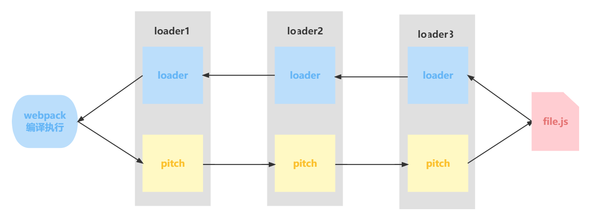

# Loader原理

## loader概念

使用webpack将不同类型的文件转换为webpack可识别的模块。

## loader执行顺序

1. 分类

- pre: 前置loader
- normal: 普通loader
- inline: 内联loader
- post: 后置loader

2. 执行顺序

- 四类loader的执行顺序为：pre > normal > inline > post
- 相同类型的loader按从右到左的顺序执行。

例如：

```js
// 此时loader执行顺序：loader3 - loader2 - loader1
module: {
  rules: [
    {
      test: /\.js$/,
      loader: "loader1",
    },
    {
      test: /\.js$/,
      loader: "loader2",
    },
    {
      test: /\.js$/,
      loader: "loader3",
    },
  ],
},

```

```js
// 此时loader执行顺序：loader1 - loader2 - loader3
module: {
  rules: [
    {
      enforce: "pre",
      test: /\.js$/,
      loader: "loader1",
    },
    {
      // 没有enforce就是normal
      test: /\.js$/,
      loader: "loader2",
    },
    {
      enforce: "post",
      test: /\.js$/,
      loader: "loader3",
    },
  ],
},
```

3. 使用loader的方式

- 配置方式: 在wabpack.config.js文件中指定loader。（pre,normal,post loader）;
- 内联方式: 在引入模块时，通过loader属性指定。（inline loader）。

4. 内联（inline）loader

用法：`import styles from 'style-loader!css-loader?modules!./style.css'`;

含义：
- 使用 `css-loader` 和 `style-loader` 处理 `styles.css` 文件.
- 通过 `!` 将资源中的多个loader分开。

inline可以通过不同的前缀，跳过其他的loader。

- `!` 跳过normal loader。

`import styles from '!style-loader!css-loader?modules!./styles.css'`;

- `-!` 跳过 pre 和 normal loader

`import Styles from '-!style-loader!css-loader?modules!./styles.css'`;

- `!!` 跳过 pre、 normal 和 post loader。

`import Styles from '!!style-loader!css-loader?modules!./styles.css';`

## 开发一个loader

### 1. 最简单的loader

```js
// loaders/loader1.js
module.exports = function loader1(content) {
  console.log("hello loader");
  return content;
};

```

它接受要处理的源码作为参数，输出转换后的js代码。

### 2.loader接受的参数

- content：源码
- map SourceMap数据
- meta 数据

## loader分类

### 1.同步loader

```js
module.exports = function (content, map, meta) {
  return content;
};
```

`this.callback`方法更灵活，因为它云熙传递多个参数，而不仅仅是`content`。

```js
module.exports = function (content, map, meta) {
  // 传递map，让source-map不中断
  // 传递meta，让下一个loader接收到其他参数
  this.callback(null, content, map, meta);
  return; // 当调用 callback() 函数时，总是返回 undefined
};
```

### 2.异步loader

```js

module.exports = function(content,map,meta){
    const callback = this.async();
  // 进行异步操作
  setTimeout(() => {
    callback(null, result, map, meta);
  }, 1000);
}
```

由于同步计算过于耗时，在Nodejs这样的单线程环境下进行此操作并不是好的方案，我们尽可能使loader异步化。但如果计算量很小，同步loader也是可以的。

### 3.raw loader

默认情况下，资源文件会被转化为UTF-8字符串，然后传给loader。通过设置raw为true，loader可以接收原始的Buffer。

```js
module.exports = function (content){
    // content 是一个Buffer数据
    return content;
}

module.exports.raw = true;// 开启 Raw Loader
```

### 4.pitching loader

```js
module.exports = function (content) {
  return content;
};
module.exports.pitch = function (remainingRequest, precedingRequest, data) {
  console.log("do somethings");
};
```

webpack会先从左到右执行loader，链中的每个，loader上的pitch方法（如果有），然后再从右到左执行loader链中的每个loader上的普通loader方法。



在这个过程中如果任何pitch有返回值，则loader链被阻断。webpack会跳过后面的所有的pitch和loader，直接进入上一个loader。


### loader API

<table>
    <tr>
        <th>方法名</th>
        <th>含义</th>
        <th>用法</th>
    </tr>
    <tr>
        <td>this.async</td>
        <td>异步回调 loader。返回 this.callback</td>
        <td>const callback = this.async()</td>
    </tr>
    <tr>
        <td>this.callback</td>
        <td>可以同步或者异步调用的并返回多个结果的函数</td>
        <td>this.callback(err, content, sourceMap?, meta?)</td>
    </tr>
    <tr>
        <td>this.getOptions(schema)</td>
        <td>获取 loader 的 options</td>
        <td>this.getOptions(schema)</td>
    </tr>
    <tr>
        <td>this.emitFile</td>
        <td>产生一个文件</td>
        <td>this.emitFile(name, content, sourceMap)</td>
    </tr>
    <tr>
        <td>this.utils.contextify</td>
        <td>返回一个相对路径</td>
        <td>this.utils.contextify(context, request)</td>
    </tr>
    <tr>
        <td>this.utils.absolutify</td>
        <td>返回一个绝对路径</td>
        <td>this.utils.absolutify(context, request)</td>
    </tr>
</table>   

更多文档，请查阅 [webpack官方loader api文档](https://webpack.docschina.org/api/loaders/#the-loader-context)